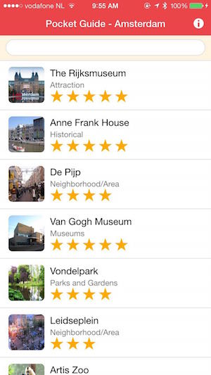

### Create a new Project
1. Create a PhoneGap project using either the PhoneGap CLI or the PhoneGap Desktop Application you learned in the first workshop. For example:

        phonegap create pg-workshop com.yourname.workshop PGWorkshop 
      
2. Navigate into the newly created project folder:

        cd pg-workshop        

### Replace Contents
1. Download the supporting files for this tutorial as a zip file [here](https://github.com/hollyschinsky/pocket-guide/archive/master.zip), 
or clone the repository:

        git clone https://github.com/hollyschinsky/pocket-guide

1. Delete the contents of your project's **www** folder.

1. Unzip (if needed) and copy the contents of **solutions/www1** into your project's **www** folder.   
    **NOTE:** Your project folder name must remain www, so it's better to copy in just the contents rather than the folder itself. 
    If you copy the *www1* folder itself in then you will need to rename it to *www*.
    
1. Copy the **config.xml** file from the root of the repo project and replace yours with it to save from having to install plugin
dependencies. If you don't replace yours and want to test with the CLI on your local hard drive you will need to manually add the 
plugins as they are needed in the lessons. If you're using the PhoneGap Developer App to preview the apps, it will already include
 the core PhoneGap plugins but some used in this workshop are 3rd party and will not work. 

### Run the Initial Application
1. Serve and pair with the PhoneGap Developer App from the PhoneGap CLI or PhoneGap Desktop: 
  
   - **From PhoneGap CLI**            
     1. Run `$ phonegap serve`
     2. Connect to the URL reported from the `serve` command in the PhoneGap Developer app on a mobile device
 
     
   - **From PhoneGap Desktop**
     1. Click the play **>** button if your project is not active 
     2. Connect to the URL reported from PhoneGap Desktop in the PhoneGap Developer app on a mobile device
            
   - **Advanced Option:** those with proper local setup can run on device/emulator with PhoneGap CLI with one of the following:
        
            $ phonegap run ios
            $ phonegap run ios --device
            $ phonegap run android             
            $ phonegap run android --device               
      
      > This option requires a mobile SDK setup. If you have Mac and Xcode you should be able to use iOS, but Android requires [additional SDK installation and setup](http://developer.android.com/sdk). 

       **NOTE:** If you don't have the PhoneGap Developer App, you can still serve and run the app in a browser by entering the location server is running on.   

2. Ensure you see the application load with a listing of Amsterdam's most popular locations. Try typing in a few characters to see the filtering
 on the name.    
    
    
 
  **Note:** We'll be adding additional features as we go along so not everything will be functional at this point.

> Part-by-Part solutions are available in the [repo](http://github.com/hollyschinsky/pocket-guide/solutions) folder for each lesson. The number of the lesson
corresponds to the folder and represents the completed lesson for that module. 

<a href="index.html" class="btn btn-default"><i class="glyphicon glyphicon-chevron-left"></i> Previous</a>
<a href="module2.html" class="btn btn-default pull-right">Next <i class="glyphicon
glyphicon-chevron-right"></i></a>

