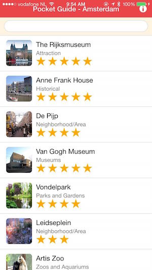
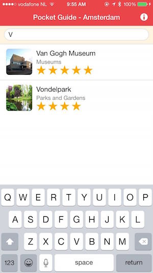
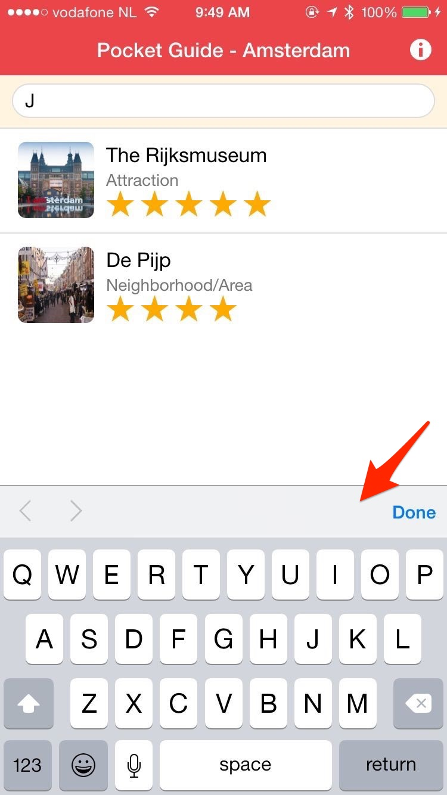
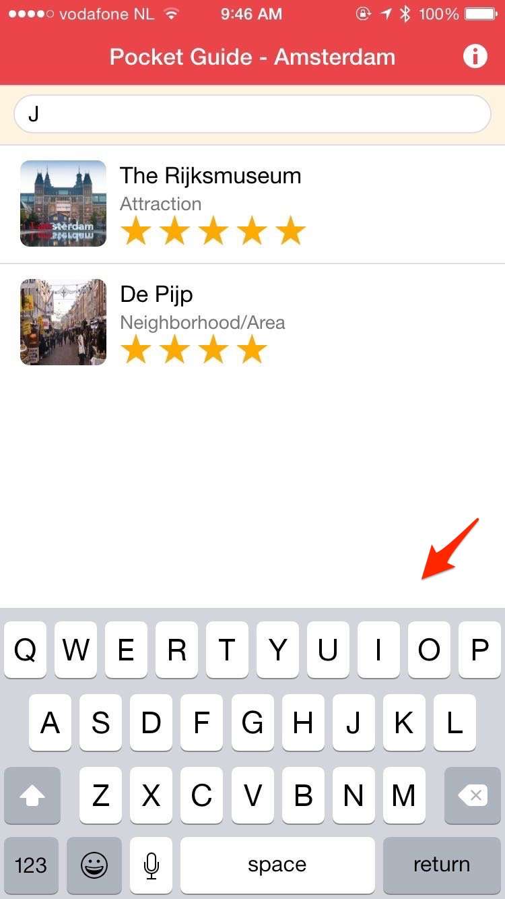
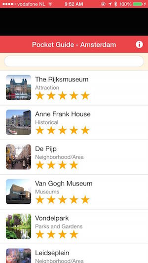

This module will take you through a couple steps to polish the application and give you some tips on configuration settings to be aware of.     

### Status Bar Handling

  In iOS7 and above the status bar overlaps the application views. As a result, the status bar text may collide with the 
  application's header text as shown in the screenshot above. You can fix this issue using the [statusbar plugin](https://github.com/apache/cordova-plugin-statusbar).
 
  

   > We can use the status bar plugin to fix this. This plugin is already included in the config.xml for the application but if you need to add it, use the 
   following: `phonegap plugin add org.apache.cordova.statusbar`

    

1. There are two options for using the statusbar to fix this issue, via configuration or programmatically. 

   In either case, set the *overlay* setting to false to move our app content below the status bar. Also use the other options to set the status bar background style and text/icons to match the app header colors:   
   
   Choose to implement one of the options below:

   - **Programatically**
        Open **www/js/app.js** and add the following code at the top of the `deviceready` handler:
        
          
            StatusBar.overlaysWebView( false );
            StatusBar.backgroundColorByHexString('#209dc2');
            StatusBar.styleLightContent();
        
   - **Configuration (config.xml)**
    Open your **config.xml** file in the root of your project and add the following lines to the end of the preferences:
  
         
            <preference name="StatusBarOverlaysWebView" value="false" />
            <preference name="StatusBarBackgroundColor" value="#209dc2"/>
            <preference name="StatusBarStyle" value="lightcontent" />
            
        
2. Now build and run the application again to see the results, there should no longer be an overlap:

    
      
### Keyboard Accessory Bar 

We can suppress the accessory keyboard that pops up with the **Done** button on it as shown in this screenshot by using a custom plugin from the Ionic Framework and then use a method to hide it:

> We can use a keyboard plugin from Ionic to hide this. This plugin is already included in the config.xml for the application but if you need to add it, use the 
   following: `phonegap plugin add cordova.ionic.keyboard`  
  
1. In **www/js/app.js**, add the following code to the `deviceready` handler:

        if (cordova.plugins.Keyboard)
            cordova.plugins.Keyboard.hideKeyboardAccessoryBar(true);
           

2. Now build the application again and test to see the result.

### Turn off WebView Bounce / Overscroll Effect
You may notice if you pull down on your app from the header bar, you will see a black space between it and the statusbar and a bounce effect on iOS as shown below. 

  
You can disable this effect by setting a property in the config.xml file. 

1. In the **config.xml** in the root of your project, add the following property to the end of the preferences:

        <preference name="DisallowOverscroll" value="true" />

2. Now build and run the application again and the webview (your app) should stay in place. 

 
 